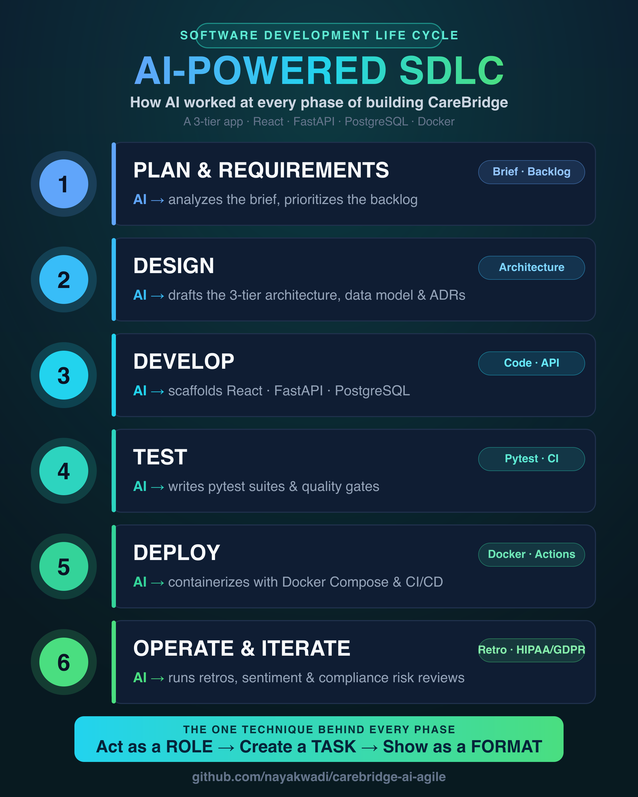
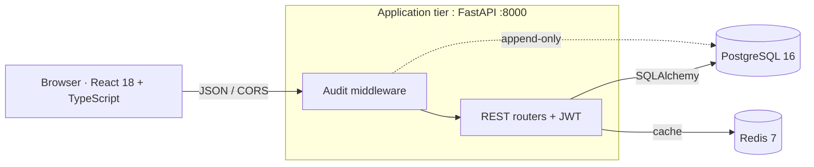

# AI-Powered Agile Project Demo With a 3 Tier App : CareBridge 🏥

[](https://github.com/nayakwadi/carebridge-ai-agile/actions/workflows/ci.yml)
[](LICENSE)


> A working **3-tier healthcare application** *and* the complete **AI-powered Agile playbook** used to plan, staff, and govern it : built to demonstrate the skills from LinkedIn Learning's *AI-Powered Agile: Strategies for Modern Project Managers* (Chapters 1–3).

<p align="center">
  
</p>

Grooming a backlog used to take more time. After this course, the technique that stuck was learning to **direct AI like a senior teammate : Act as a ROLE → Create a TASK → Show as a FORMAT** : and to keep the human judgment where it belongs. This Project demonstrates a realistic product, a real architecture, and every Agile artifact produced *with* AI and *refined by* a PM.

This repo is two things at once:
1. **A runnable 3-tier app** : React + TypeScript ▸ FastAPI ▸ PostgreSQL/Redis, one command to start.
2. **A documented Agile/AI delivery record** : backlog prioritization, requirements analysis, team staffing, culture, and regulatory risk : each artifact showing *the exact prompt used* and *the judgment applied on top of it*.

---

## What this repository demonstrates

| Course  | Skill | Where to find it |
|---|---|---|
| Prompt technique | Act as ROLE → TASK → FORMAT | [prompt-engineering guide](docs/agile-ai/00-prompt-engineering-guide.md) · [reusable library](docs/prompts/prompt-library.md) |
| 1.1 | AI backlog prioritization (with rationale) | [ch1-01](docs/agile-ai/ch1-01-backlog-prioritization.md) |
| 1.3 | AI requirements analysis (ambiguity & gaps) | [ch1-03](docs/agile-ai/ch1-03-requirements-refinement.md) |
| 1.4 | AI-assisted retrospectives | [ch1-04](docs/agile-ai/ch1-04-retrospectives.md) |
| 2.1 | Team staffing & skills/capabilities matrix | [ch2-01](docs/agile-ai/ch2-01-team-staffing.md) |
| 2.1 | AI-authored job description | [ch2-01-jd](docs/agile-ai/ch2-01-job-description.md) |
| 2.2 | Agile-knowledge assessment | [ch2-02-quiz](docs/agile-ai/ch2-02-agile-knowledge-quiz.md) |
| 2.2 | SCRUM × SCARF matrix | [ch2-02-scarf](docs/agile-ai/ch2-02-scrum-scarf-matrix.md) |
| 2.3 | 5Es cross-functional plan | [ch2-03](docs/agile-ai/ch2-03-5es-framework.md) |
| 3.1 | Agile culture inhibitors & matrix | [ch3-01](docs/agile-ai/ch3-01-agile-culture-matrix.md) |
| 3.2 | Culture, servant-leadership & survey program | [ch3-02](docs/agile-ai/ch3-02-culture-program.md) |
| 3.3 | Regulatory register (HIPAA / GDPR / …) | [ch3-03](docs/agile-ai/ch3-03-regulatory-register.md) |
| 3.4 | Multi-geography risk register | [ch3-04](docs/agile-ai/ch3-04-geography-risk-register.md) |

**New here? Start with [`docs/agile-ai/`](docs/agile-ai/README.md)** : it indexes every artifact against the course.

---

## The product: CareBridge

An AI-assisted **patient care-coordination platform**. Hospital care teams manage patients, care plans, and a Kanban of care tasks across transitions (hospital → home → specialist) : with an immutable HIPAA-style audit trail. See the [Product Brief](docs/product/PRODUCT-BRIEF.md), [backlog](docs/product/product-backlog.md), and [personas](docs/product/personas.md).

## Architecture (3-tier)



Full write-up in [ARCHITECTURE.md](docs/architecture/ARCHITECTURE.md) · data model in [data-model.md](docs/architecture/data-model.md) · decisions in [ADRs](docs/architecture/adr/).

---

## Quickstart : one command

```bash
git clone https://github.com/nayakwadi/carebridge-ai-agile.git
cd carebridge-ai-agile
docker compose up --build
```

| Tier | URL |
|---|---|
| Web app (presentation) | http://localhost:5173 |
| API + Swagger docs (application) | http://localhost:8000/docs |
| PostgreSQL (data) | `localhost:5432` (user/pass/db: `carebridge`) |
| Redis (cache) | `localhost:6379` |

The database auto-seeds with synthetic, de-identified patients and care plans. Click a task card on the board to advance its status. Demo auth: `POST /api/auth/token` with any seeded care-team email and password `demo`.

### Run a single tier without Docker

```bash
# Backend (application tier)
cd backend && python -m venv .venv && source .venv/bin/activate
pip install -r requirements-dev.txt
pytest && ruff check app tests          # 12 tests, lint clean

# Frontend (presentation tier)
cd frontend && npm install
npm run dev                              # http://localhost:5173
npm run typecheck                        # strict TS
```

---

## Repository map

```
carebridge-ai-agile/
├── docs/
│   ├── agile-ai/        ★ the course demonstration : 12 AI-powered Agile artifacts + guide
│   ├── architecture/    3-tier write-up, Mermaid ER/flow diagrams, ADRs
│   ├── product/         product brief, backlog, personas
│   └── prompts/         reusable prompt library
├── frontend/            Presentation tier : React + TypeScript + Vite
├── backend/             Application tier : FastAPI, Redis cache, JWT, audit middleware, pytest
├── database/            Data tier : PostgreSQL schema + seed (init.sql, seed.sql)
├── .github/             CI (lint/test/build), issue & PR templates
└── docker-compose.yml   One-command 3-tier orchestration
```

## Tech stack

| Tier | Technology |
|---|---|
| Presentation | React 18, TypeScript 5, Vite |
| Application | FastAPI, SQLAlchemy 2, Redis, PyJWT, Pydantic |
| Data | PostgreSQL 16, Redis 7 |
| Tooling | Docker Compose, Ruff, Pytest, GitHub Actions CI |

---

## Honest scope notes
- This is a **vertical slice**, not a complete EHR : enough surface to show real 3-tier engineering.
- **Auth is a demonstration stub** (JWT + shared demo password). Production would use OIDC / SMART-on-FHIR.
- All patient data is **synthetic and de-identified**.
- Chapter 4 of the course (the capstone challenge) is intentionally **out of scope**.

## License & author

MIT : see [LICENSE](LICENSE). Built by **Sridhar Nayakwadi**, Technical Project Manager, as a hands-on demonstration of AI-powered Agile delivery. Contributions welcome : see [CONTRIBUTING.md](CONTRIBUTING.md).
