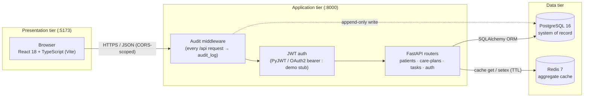

# CareBridge : System Architecture

CareBridge is an AI-assisted patient care-coordination platform. Hospital care teams use it to
manage **patients**, **care plans**, and **tasks** across care transitions (hospital → home →
specialist), with the goal of cutting avoidable 30-day readmissions and lifting care-task
follow-through. This document describes the implemented architecture: a classic **three-tier**
system orchestrated by Docker Compose, with a HIPAA-conscious audit trail baked into the
application tier.

> Scope: this reflects the code in this repository as built. Where a control is a deliberate
> demonstration stub (e.g. JWT auth), it is called out explicitly along with what production
> would look like.

---

## Overview

| Tier | Technology | Port | Responsibility |
|------|-----------|------|----------------|
| Presentation | React 18 + TypeScript + Vite | `5173` | Care-team dashboard, patient list, care-plan Kanban board |
| Application | FastAPI + SQLAlchemy + PyJWT + Redis client | `8000` | REST API, request validation, auth, HIPAA-style audit middleware, caching |
| Data | PostgreSQL 16, Redis 7 | `5432` / `6379` | System of record (relational, ACID) + ephemeral aggregate cache |

The whole stack comes up with one command : `docker compose up --build` : fully schema-loaded and
seeded. Compose defines four services: `web`, `api`, `db`, and `cache`.



---

## Why three tiers

The three-tier split is not ceremony : each boundary buys something concrete for a regulated
healthcare product:

- **Separation of concerns.** The React app owns presentation and never talks to the database;
  the API owns business rules, validation, and auth; PostgreSQL owns durable state and integrity
  constraints. A change to the Kanban board never risks the data model, and a schema change is
  mediated by typed Pydantic schemas at the API edge.
- **Independent scaling.** The read-heavy presentation tier (static assets, CDN-friendly) scales
  differently from the API (stateless, horizontally scalable behind a load balancer) and from the
  database (vertical + read replicas). Decoupling lets each scale on its own curve.
- **Clear security boundary.** PHI lives only behind the API. The browser holds a short-lived
  token, never database credentials. Every request that can touch PHI passes through a single
  choke point : the audit middleware : which is exactly where a healthcare auditor wants the
  access trail to be enforced.

---

## Tier-by-tier breakdown

### Presentation tier : React 18 + TypeScript (Vite)

- **Responsibilities:** render the care-team dashboard, patient list, and the care-plan Kanban
  board; collect input; call the API; hold the bearer token for the session.
- **Tech:** React 18, TypeScript, Vite dev server on `:5173`. The API base URL is injected via
  `VITE_API_BASE_URL` (set to `http://localhost:8000` in Compose).
- **Key files:** `frontend/` (Vite app), `docker-compose.yml` (`web` service).

The presentation tier is intentionally "dumb about data": it knows endpoints and shapes, not
storage. All authorization and validation decisions are enforced server-side.

### Application tier : FastAPI

- **Responsibilities:** expose a versioned REST API, validate every request/response with Pydantic
  schemas, authenticate via JWT, write the audit trail, and serve cached aggregates.
- **Tech:** FastAPI on `:8000` (interactive Swagger UI at **`/docs`**), SQLAlchemy ORM, PyJWT,
  a Redis client, Pydantic settings. CORS is scoped to the web origin only.
- **Key files:**
  - `backend/app/main.py` : app assembly, middleware registration, lifespan (DB wait, `create_all`, seed), `/health` and `/api/stats`.
  - `backend/app/routers/` : `patients.py`, `care_plans.py`, `tasks.py`, `auth.py`.
  - `backend/app/core/audit.py` : `AuditMiddleware` (the HIPAA trail).
  - `backend/app/core/security.py` : JWT issue/verify (HS256).
  - `backend/app/core/cache.py` : Redis wrapper that degrades to a no-op when Redis is down.
  - `backend/app/core/db.py` / `config.py` : engine/session wiring and typed settings.
  - `backend/app/models.py` / `schemas.py` : SQLAlchemy models and Pydantic I/O schemas.

The router surface (all PHI paths are under `/api`):

| Method | Path | Purpose |
|--------|------|---------|
| `GET` | `/api/patients` | List patients |
| `POST` | `/api/patients` | Create patient (rejects duplicate MRN, `409`) |
| `GET` | `/api/patients/{id}` | Get one patient |
| `GET` | `/api/patients/{id}/care-plans` | Care plans for a patient |
| `GET` | `/api/care-plans` | List care plans |
| `POST` | `/api/care-plans` | Create care plan (validates patient exists) |
| `GET` | `/api/care-plans/{id}/tasks` | Tasks for a care plan (the Kanban board) |
| `GET`/`POST` | `/api/tasks` … | Task CRUD |
| `POST` | `/api/auth/token` | Exchange credentials for a JWT |
| `GET` | `/api/auth/me` | Resolve the authenticated subject |
| `GET` | `/api/stats` | Cached dashboard counts (15s TTL) |
| `GET` | `/health` | Liveness + cache availability |

### Data tier : PostgreSQL 16 + Redis 7

- **PostgreSQL** is the system of record. The schema is the single source of truth in
  `database/init.sql`, auto-loaded by the Postgres container on first boot via
  `docker-entrypoint-initdb.d`. SQLAlchemy mirrors the same tables; `create_all` is a no-op once
  the SQL has run. Integrity is enforced in the database itself : `CHECK`-constrained enums,
  `UNIQUE` keys (`email`, `mrn`), and `FOREIGN KEY` cascade rules : so bad state cannot persist
  even if an application bug slips through. See [`data-model.md`](./data-model.md).
- **Redis** is an ephemeral, best-effort cache for aggregate reads (currently `/api/stats`, 15s
  TTL). It holds **no PHI** and is never the source of truth: if Redis is unavailable the cache
  layer transparently no-ops and the API serves directly from Postgres.
- **Key files:** `database/init.sql` (DDL), `database/seed.sql` (sample care team, patients,
  plans, tasks), `docker-compose.yml` (`db` and `cache` services with health checks).

---

## Request flow : loading a patient's care-plan board

A walk-through of the highest-value read path: a care coordinator opens a patient and the UI
renders that patient's care-plan Kanban board.

1. **Browser → API.** The React app issues `GET /api/patients/{id}/care-plans`, then
   `GET /api/care-plans/{planId}/tasks`, attaching `Authorization: Bearer <jwt>`. The request
   leaves the presentation tier and crosses the security boundary into the API on `:8000`.
2. **CORS check.** FastAPI's CORS middleware confirms the origin is the allow-listed web app
   (`http://localhost:5173`); anything else is rejected before any handler runs.
3. **Routing + validation.** FastAPI matches the route, coerces the path parameter to `int`, and
   selects the handler in `routers/care_plans.py` / `routers/patients.py`.
4. **Auth resolution.** The bearer token is decoded (HS256, PyJWT). The resolved subject identifies
   *who* is making the request : captured for the audit trail.
5. **Database read.** The handler obtains a scoped SQLAlchemy session (`get_db`) and queries
   PostgreSQL : e.g. `SELECT … FROM tasks WHERE care_plan_id = :id ORDER BY id`. Results are
   serialized through the `TaskOut` / `CarePlanOut` Pydantic schemas, which strip the response to
   exactly the declared fields (PHI minimization at the wire).
6. **Cache (aggregate path).** Pure list reads go straight to Postgres. The dashboard summary the
   board sits inside (`GET /api/stats`) checks Redis first: on a hit it returns the cached counts
   (`cached: true`); on a miss it counts in Postgres and writes the result back with a 15s TTL via
   `SETEX`. This keeps the dashboard snappy without ever caching patient-identifying rows.
7. **Audit write.** On the way *out*, `AuditMiddleware` intercepts the response for any `/api`
   path and appends one `audit_log` row: `actor` (decoded JWT subject, or `anonymous`), `action`
   (`READ` for `GET/HEAD/OPTIONS`, else `WRITE`), `method`, `path`, `status_code`, and
   `client_ip`. The audit write is wrapped so an audit failure can never corrupt the user response.
8. **API → Browser.** FastAPI returns JSON. React hydrates the Kanban columns (`todo`,
   `in_progress`, `blocked`, `done`) and the board renders.

The important property: **every** PHI-bearing request, success or failure, leaves a tamper-evident
footprint in `audit_log` : including reads, which is what HIPAA's access-accounting expectations
actually require.

---

## Security & HIPAA posture

This is a portfolio build, but it is structured around the controls a real HIPAA + SOC 2 Type II
effort would demand:

- **Audit trail (implemented).** `AuditMiddleware` records every `/api` request : *reads
  included* : to the append-only `audit_log` table: actor, READ/WRITE action, method, path, status
  code, client IP, timestamp. By convention no `UPDATE`/`DELETE` grants would be issued on this
  table in production, making the trail effectively immutable.
- **Authentication (demo stub → production).** Auth today is a deliberate demonstration stub:
  `POST /api/auth/token` issues an HS256 JWT (PyJWT) and middleware/handlers verify the bearer
  token. **In production this would be replaced by an external identity provider : OIDC, and for
  clinical interoperability SMART-on-FHIR** : rather than a shared demo password, with short-lived
  access tokens, refresh rotation, and role-based authorization.
- **Least-privilege data tier.** The schema enforces integrity at the database (`CHECK` enums,
  `UNIQUE`, FK cascades). A production deployment would run the API under a dedicated DB role with
  only the `SELECT/INSERT/UPDATE` grants it needs, and would deny `UPDATE/DELETE` on `audit_log`.
- **Secrets via environment / secrets manager.** No secrets are committed. `JWT_SECRET`,
  `DATABASE_URL`, and `REDIS_URL` are injected as environment variables (Compose defaults are for
  local dev only and are clearly placeholder, e.g. `dev-secret-change-me`). Production would source
  these from a managed secrets store (AWS Secrets Manager / SSM Parameter Store).
- **PHI minimization.** Pydantic response schemas return only declared fields, so handlers can't
  accidentally leak columns. Redis caches only non-identifying aggregate counts : never patient
  rows. MRNs in the seed data are de-identified demo values.
- **Network boundary.** CORS is scoped to the single web origin; the browser never holds DB
  credentials. PHI is reachable only through the audited API choke point.

---

## Scalability & evolution notes

- **Stateless API.** Handlers keep no session state, so the `api` service scales horizontally
  behind a load balancer with no sticky-session requirement.
- **Read scaling.** PostgreSQL read replicas absorb the read-heavy dashboard/list traffic; Redis
  already offloads repeated aggregate counts and can expand to per-resource caching with
  explicit invalidation when write volume grows.
- **Schema as contract.** `init.sql` is the single source of truth; the migration story would move
  to a versioned tool (Alembic) before GA so schema changes are reviewable and reversible.
- **Auth evolution.** Swapping the JWT stub for OIDC/SMART-on-FHIR is isolated to
  `core/security.py` and the auth router : no handler or data change required, by design.
- **Async headroom.** FastAPI's async stack means I/O-bound work (downstream FHIR calls,
  notifications) can be made non-blocking without changing the framework.

---

## Local run

One command brings up all four services, schema-loaded and seeded:

```bash
docker compose up --build
```

| Service | URL |
|---------|-----|
| Web (React) | http://localhost:5173 |
| API (FastAPI) | http://localhost:8000 |
| Swagger UI | http://localhost:8000/docs |
| Postgres | localhost:5432 |
| Redis | localhost:6379 |

Postgres loads `database/init.sql` then `database/seed.sql` on first boot (alphabetical order);
the API waits for the database to be healthy before serving.

---

### Related documents

- [Data model & ER diagram](./data-model.md)
- [ADR 0001 : Three-tier architecture](./adr/0001-three-tier-architecture.md)
- [ADR 0002 : FastAPI application tier](./adr/0002-fastapi-application-tier.md)
- [ADR 0003 : PostgreSQL data tier](./adr/0003-postgresql-data-tier.md)
- [ADR 0004 : Docker Compose local orchestration](./adr/0004-docker-compose-local-orchestration.md)
