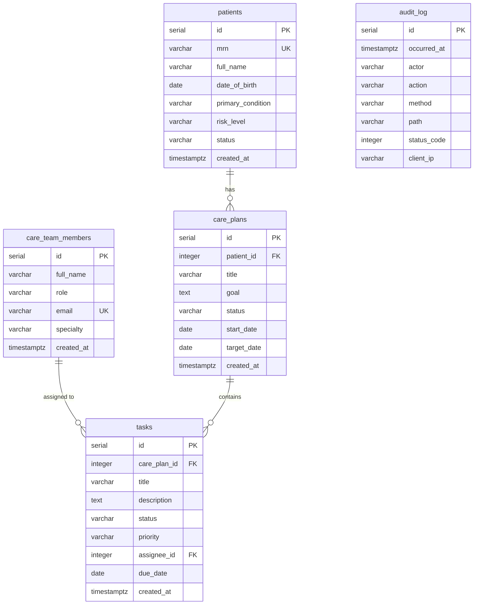

# CareBridge — Data Model

The canonical schema lives in [`database/init.sql`](../../database/init.sql) and is auto-loaded by
the PostgreSQL container on first boot. The FastAPI backend mirrors these tables as SQLAlchemy
models, so the DDL is the single source of truth. This document is the human-readable reference.

---

## Entity-relationship diagram

**Relationships**

- `patients ||--o{ care_plans` — a patient has many care plans; a plan belongs to exactly one patient.
- `care_plans ||--o{ tasks` — a care plan has many tasks; a task belongs to exactly one plan.
- `care_team_members ||--o{ tasks` — a member can be the assignee of many tasks; a task has at most one assignee.
- `audit_log` is intentionally standalone (no FKs) — it is an immutable access log, not transactional data.

---

## Table reference

### `care_team_members`

The clinical roster (physicians, nurses, care coordinators, social workers, pharmacists).

| Column | Type | Notes |
|--------|------|-------|
| `id` | `SERIAL` | Primary key |
| `full_name` | `VARCHAR(120)` | `NOT NULL` |
| `role` | `VARCHAR(60)` | `NOT NULL`. Physician \| Nurse \| Care Coordinator \| Social Worker \| Pharmacist |
| `email` | `VARCHAR(160)` | `NOT NULL`, **`UNIQUE`** — natural key for a member |
| `specialty` | `VARCHAR(120)` | Nullable (e.g. "Transitions of Care") |
| `created_at` | `TIMESTAMPTZ` | `NOT NULL DEFAULT now()` |

### `patients`

The patient under coordination. Demo MRNs are de-identified.

| Column | Type | Notes |
|--------|------|-------|
| `id` | `SERIAL` | Primary key |
| `mrn` | `VARCHAR(20)` | `NOT NULL`, **`UNIQUE`** — Medical Record Number |
| `full_name` | `VARCHAR(120)` | `NOT NULL` |
| `date_of_birth` | `DATE` | `NOT NULL` |
| `primary_condition` | `VARCHAR(160)` | `NOT NULL` |
| `risk_level` | `VARCHAR(10)` | `NOT NULL DEFAULT 'medium'`. **`CHECK`** ∈ `low`, `medium`, `high` |
| `status` | `VARCHAR(20)` | `NOT NULL DEFAULT 'active'`. **`CHECK`** ∈ `active`, `discharged`, `transferred` |
| `created_at` | `TIMESTAMPTZ` | `NOT NULL DEFAULT now()` |

### `care_plans`

A coordinated plan of care for one patient.

| Column | Type | Notes |
|--------|------|-------|
| `id` | `SERIAL` | Primary key |
| `patient_id` | `INTEGER` | `NOT NULL`, **FK → `patients(id)` `ON DELETE CASCADE`** |
| `title` | `VARCHAR(160)` | `NOT NULL` |
| `goal` | `TEXT` | Nullable — free-text clinical goal |
| `status` | `VARCHAR(20)` | `NOT NULL DEFAULT 'active'`. **`CHECK`** ∈ `draft`, `active`, `on_hold`, `completed` |
| `start_date` | `DATE` | Nullable |
| `target_date` | `DATE` | Nullable |
| `created_at` | `TIMESTAMPTZ` | `NOT NULL DEFAULT now()` |

### `tasks`

The unit of work on a care plan — the cards on the Kanban board.

| Column | Type | Notes |
|--------|------|-------|
| `id` | `SERIAL` | Primary key |
| `care_plan_id` | `INTEGER` | `NOT NULL`, **FK → `care_plans(id)` `ON DELETE CASCADE`** |
| `title` | `VARCHAR(200)` | `NOT NULL` |
| `description` | `TEXT` | Nullable |
| `status` | `VARCHAR(20)` | `NOT NULL DEFAULT 'todo'`. **`CHECK`** ∈ `todo`, `in_progress`, `blocked`, `done` (the board columns) |
| `priority` | `VARCHAR(10)` | `NOT NULL DEFAULT 'medium'`. **`CHECK`** ∈ `low`, `medium`, `high`, `urgent` |
| `assignee_id` | `INTEGER` | Nullable, **FK → `care_team_members(id)` `ON DELETE SET NULL`** |
| `due_date` | `DATE` | Nullable |
| `created_at` | `TIMESTAMPTZ` | `NOT NULL DEFAULT now()` |

### `audit_log`

The HIPAA-style access trail. One row per `/api` request, written by application-tier middleware.

| Column | Type | Notes |
|--------|------|-------|
| `id` | `SERIAL` | Primary key |
| `occurred_at` | `TIMESTAMPTZ` | `NOT NULL DEFAULT now()` |
| `actor` | `VARCHAR(160)` | Authenticated JWT subject, or `'anonymous'` |
| `action` | `VARCHAR(20)` | `NOT NULL` — `READ` (GET/HEAD/OPTIONS) or `WRITE` |
| `method` | `VARCHAR(10)` | `NOT NULL` — HTTP method |
| `path` | `VARCHAR(300)` | `NOT NULL` — request path |
| `status_code` | `INTEGER` | `NOT NULL` — response status |
| `client_ip` | `VARCHAR(64)` | Nullable — originating client IP |

---

## Design notes

- **Append-only audit log.** `audit_log` is written but never updated or deleted. In production the
  API's database role would hold `INSERT` (no `UPDATE`/`DELETE`) on this table, making the trail
  tamper-evident — the property a healthcare auditor expects. It carries no FKs deliberately: log
  rows must survive even if the referenced patient/plan/task is later removed.
- **FK cascade rules — chosen, not default.**
  - `care_plans.patient_id` and `tasks.care_plan_id` use **`ON DELETE CASCADE`**: deleting a
    patient removes their plans and (transitively) the plans' tasks, so no orphaned care data is
    left behind.
  - `tasks.assignee_id` uses **`ON DELETE SET NULL`**: removing a care-team member must not destroy
    the clinical work — the task survives, simply unassigned and ready for re-assignment.
- **CHECK-constrained enums.** Status, risk, and priority value sets are enforced by `CHECK`
  constraints in the database rather than only in application code, so invalid states (e.g. a task
  status outside the four board columns) cannot be persisted even via a direct SQL path.
- **Natural unique keys.** `care_team_members.email` and `patients.mrn` are `UNIQUE`, preventing
  duplicate clinicians or duplicate patient records; the API surfaces these as `409 Conflict`.
- **Indexes.** Beyond the primary keys, the schema indexes the hot access paths:
  `idx_care_plans_patient (patient_id)`, `idx_tasks_care_plan (care_plan_id)`,
  `idx_tasks_status (status)`, and `idx_audit_occurred_at (occurred_at)` — covering the
  patient → plans → board drill-down and time-ordered audit queries.
- **Timestamps.** All `created_at` / `occurred_at` columns are `TIMESTAMPTZ` defaulting to `now()`,
  so timeline reconstruction is timezone-correct.

See [ARCHITECTURE.md](./ARCHITECTURE.md) for how these tables are read and written at runtime.
